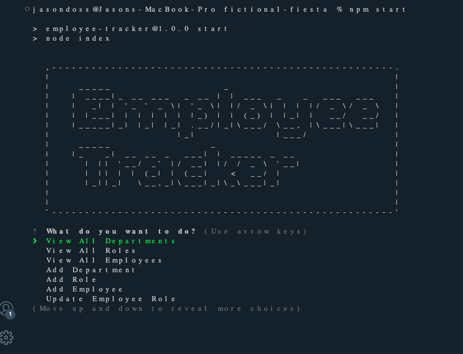
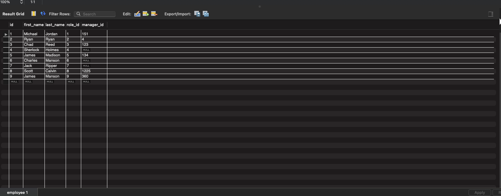

# fictional-fiesta

## Description

During this project I have created a user friendly CMS application. This application allows a non-developer to easily interact by following questions and inputting information into each selected field. As the user inputs new information it is then transferred and stored in the created MySQL tables in mysql workbench. Using this application you can add, remove, or edit employees, and departments easily by just following the questions provided. 

During this project I learned how to better use npms, mysql, and other various systems. This project was a great way to learn and become more familiar with servers and the backend of app development. 

## Installation

To install this Employee Tracker CMS simply just clone my GitHub repository, input your login in connect.js, log into your mysql workbench. Here is the link: https://github.com/dossj88/fictional-fiesta

## Usage

To use the Employee Tracker from the command line clone the repository, in the integrated terminal and run npm start. Then you will be asked what you would like to do. Every input that you do in the application will reflect on your table in MySQL. See examples below.

  
  
    
## Walk-through Video link

  

## Credits

For this project I used the following NPM's,

mysql2, console.table, Inquirer, and asciiart-logo.
